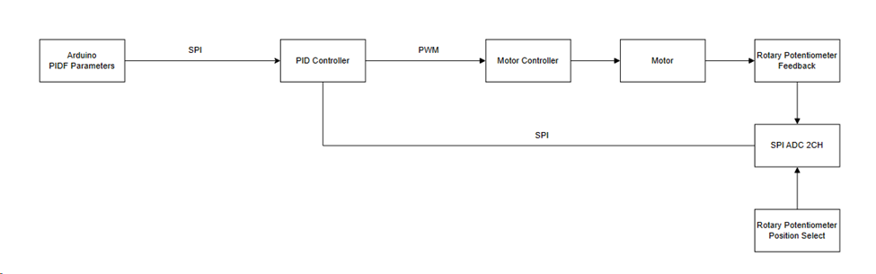
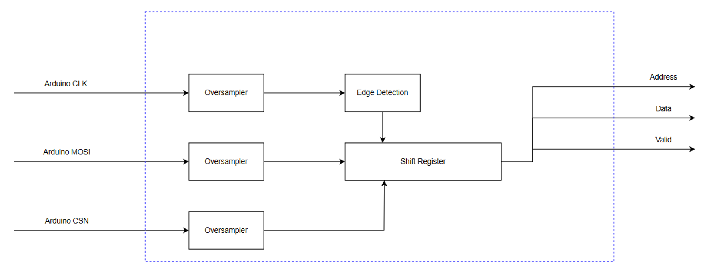

# SPI P Controller

Varun Rajesh
18-224 Spring 2024 Final Tapeout Project

## Overview

This ASIC implements a hardware P controller. There are two SPI interfaces that are responsible for programming the P controller with the P gain and the setpoint of the controller. Another SPI interface reads the feedback of the potentiometer through a MCP3202 ADC. Finally, an PWM interface connects up to a motor driver to actually control the motor.

## How it Works

This is an implementation of the SPI interface required to program parameters into the ASIC. Because of the limited amount of FFs that the design can have, rather than implementing an asynchronous FIFO to move data between the SPI clock domain and the ASIC, I’ve opted to just sample the SPI lines at a frequency much higher than the actual SPI frequency to determine where CLK transitions happen and when to shift in data. 

This then creates a pair of address and data lines which will interface with the SRAM which stores the parameters.

This SPI interface reads position data and position request data from the MCP3202 ADC. The FSM will be responsible for selecting what command sequence to clock out to the ADC as well as clocking in data for the shift register. A similar oversampling technique is used to synchronize the MISO data with the system clock. 

The P controller implementation is straightforward. All the computation can be completed in a single cycle and so no FSM is required here. The P controller requires two registers which store information on the error This then comes together to calculate what the new velocity setpoint. Simple transform logic will turn the velocity setpoint to a PWM signal that can be sent to the motor driver.

## Inputs/Outputs

Inputs:
11: arduino_spi_clk
10: arduino_spi_mosi
9:  arduino_spi_cs_n
8:  adc_spi_miso

Outputs:
11: adc_spi_clk
10: adc_spi_mosi
9:  adc_spi_cs_n
8:  motor controller pwm_a
7:  motor controller pwm_b

## Hardware Peripherals

This ASIC interfaces with an Arduino with a SPI interface to program parameters and an MCP3202 ADC to read the analog feedback. 

## Design Testing / Bringup

The test for this is to write to the input SPI interface from an arduino to set the parameters of the controller. The SPI interface uses SPI mode 0. The first byte should contain the address of the register. 0 is for the p parameter and 1 is for the setpoint. The next byte contains the actual parameter. This is an 8 bit two's complement number.

With the MCP3202 ADC appropriately connected to the ASIC and the feedback potentiometer hooked up to the ADCs channel 0, we can use this to get the feedback from the ADC. 

Then, by changing the setpoint or the feedback, the duty cycle of the output to the motor controller should change.

